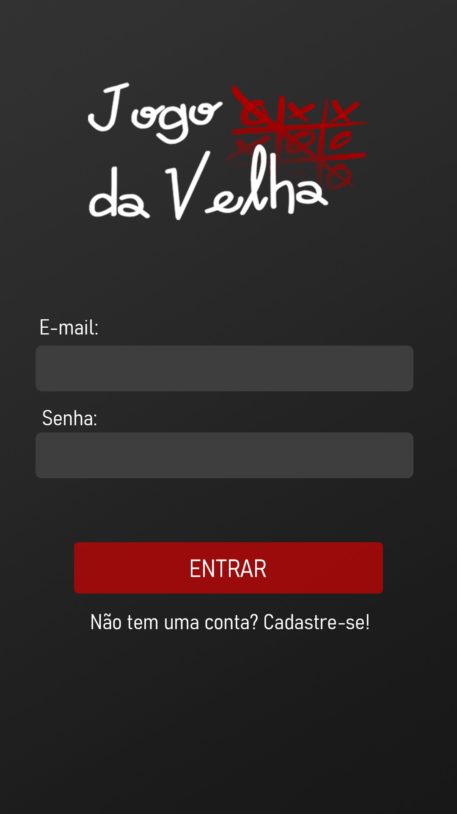
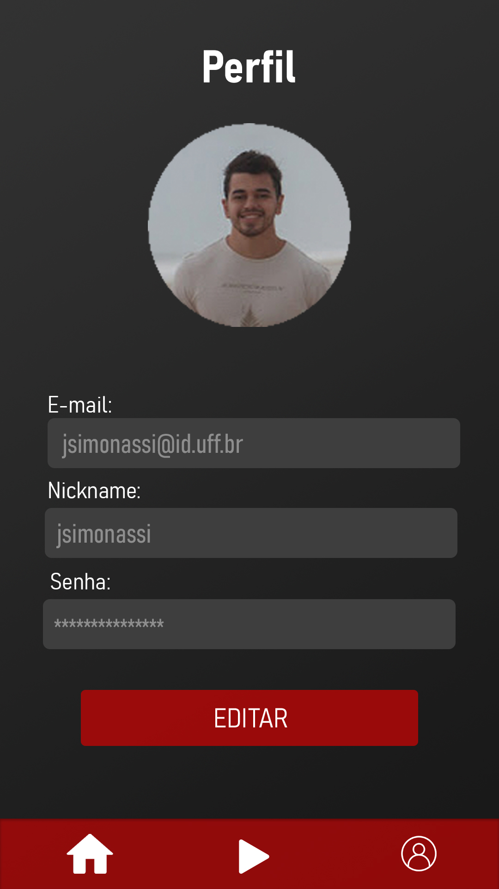
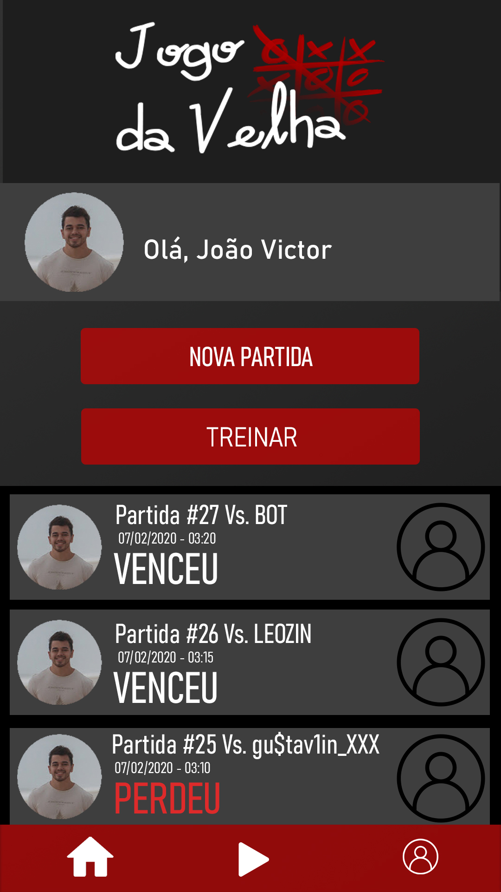
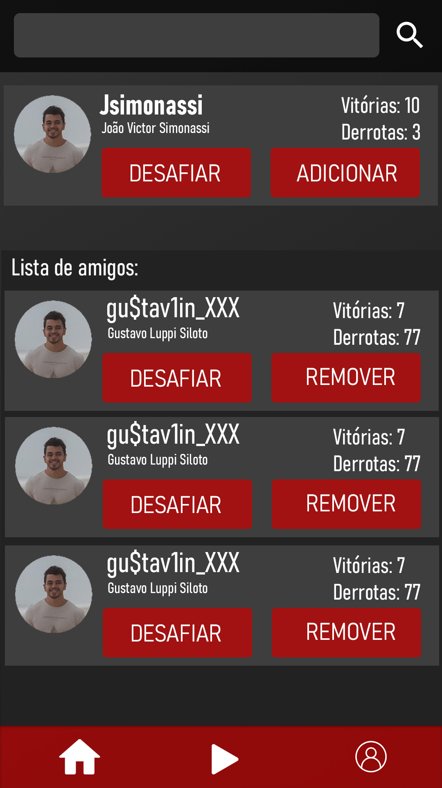

# Jogo da velha - Online

Este aplicativo está sendo desenvolvido segundo a proposta elencada pelo professor Lauro Kozovits da disciplina de Laboratório de Programação Dispositivos Móveis - UFF.
O objetivo é entender o funcionamento e modelagem de uma aplicação flutter.

### Protótipo base

Desenvolvemos as seguintes telas como base da aplicação:

   
    

#### Dúvidas e sugestões

João Victor Simonassi - ​jsimonassi@id.uff.br  
Jonatas Alves - ​jonatasalves@id.uff.br 

### Colaboradores

- Bernardo Cerqueira;
- Gustavo Luppi;
- João Victor Simonassi;
- Jonatas Alves;
- Leonardo Coreixas;
- Victor Patricio.

#

### About

This application is being developed according to the proposal listed by professor Lauro Kozovits of the discipline of Programming Laboratory for Mobile Devices - UFF.
The goal is to understand the functioning and modeling of a flutter application.

### Base prototype

We developed the following screens as the basis of the application:

   
    

#### Questions and suggestions

João Victor Simonassi - ​jsimonassi@id.uff.br  
Jonatas Alves - ​jonatasalves@id.uff.br 

### Contributors

- Bernardo Cerqueira;
- Gustavo Luppi;
- João Victor Simonassi;
- Jonatas Alves;
- Leonardo Coreixas;
- Victor Patricio.
